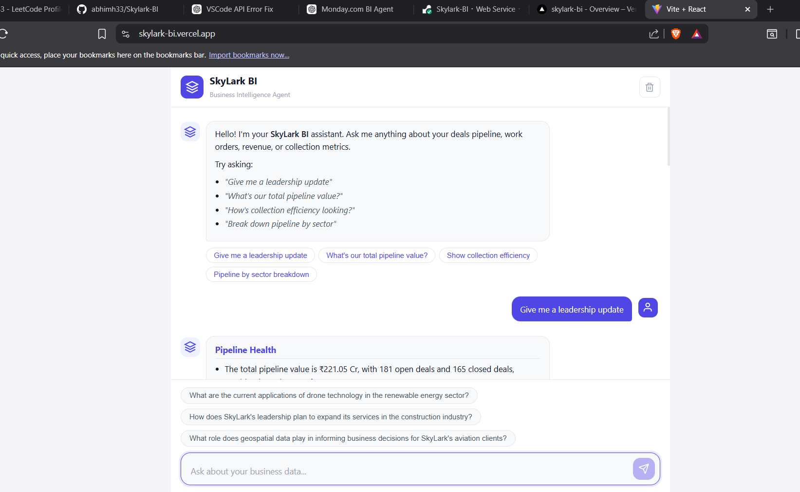
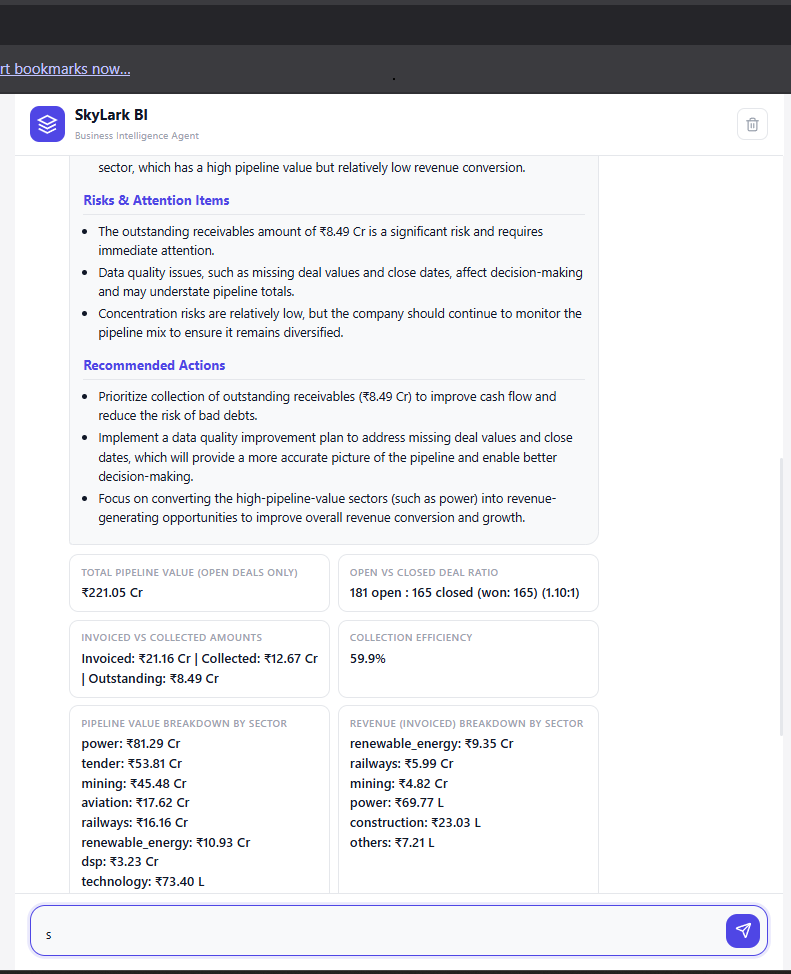

# SkyLark BI Agent

A production-ready **Business Intelligence AI Agent** that connects to live monday.com boards, computes structured business metrics, and generates executive-level insights using Groq LLM — all through a conversational chat interface.

**Live Application**: [https://skylark-bi.vercel.app](https://skylark-bi.vercel.app)  
**Backend API**: [https://skylark-bi.onrender.com](https://skylark-bi.onrender.com)  
**API Documentation**: [https://skylark-bi.onrender.com/docs](https://skylark-bi.onrender.com/docs)

> **⚠️ Important Note:** This project uses the **Groq free-tier API** for LLM inference. If you encounter errors (e.g. `429 Too Many Requests` or slow responses), it is due to **Groq API rate limits being exceeded** — not a codebase or deployment issue. The code, architecture, and deployment are fully functional. Please wait a moment and retry.

---

## Demo

<details>
<summary>📊 Leadership Update</summary>


</details>

<details>
<summary>💰 Pipeline Value</summary>


</details>

<details>
<summary>📈 Sector Breakdown</summary>


</details>

<details>
<summary>🏦 Collection Efficiency</summary>


</details>

🎬 **[Watch Demo Video](assets/skylark-bi-demo.mp4)**

---

## Architecture

```
┌─────────────────────────────────────────────────────────────┐
│                    Vercel (Frontend)                         │
│         React + Vite · Chat UI · Markdown Rendering         │
└────────────────────────┬────────────────────────────────────┘
                         │ HTTPS (POST /ask)
┌────────────────────────▼────────────────────────────────────┐
│                   Render (Backend)                           │
│                    FastAPI Server                            │
│                                                             │
│  ┌─────────┐   ┌──────────┐   ┌─────────────┐              │
│  │ monday  │──▶│  Data    │──▶│  Metrics    │              │
│  │ Client  │   │ Cleaner  │   │  Engine     │              │
│  │(GraphQL)│   │          │   │ (7 metrics) │              │
│  └─────────┘   └──────────┘   └──────┬──────┘              │
│       ▲                              │                      │
│  Board Cache                  ┌──────▼──────┐              │
│  (3 min TTL)                  │  AI Service │              │
│                               │  (Groq LLM) │              │
│                               └──────┬──────┘              │
│                                      │                      │
│                              Response Cache                 │
│                              (5 min TTL)                    │
└─────────────────────────────────────────────────────────────┘
                         │
          ┌──────────────▼──────────────┐
          │      monday.com GraphQL     │
          │   Deals Board (346 items)   │
          │   Work Orders (176 items)   │
          └─────────────────────────────┘
```

---

## Tech Stack

| Layer | Technology | Purpose |
|-------|-----------|---------|
| Frontend | React 18 + Vite | Chat interface with markdown, metric cards, suggestion chips |
| Backend | FastAPI (Python 3.11) | Async API server with Pydantic validation |
| LLM | Groq (`llama-3.3-70b-versatile`) | Intent extraction, executive summaries, follow-up suggestions |
| Data Source | monday.com GraphQL API | Live Deals & Work Orders boards |
| Caching | In-memory TTL cache (thread-safe) | Board data (3 min) + response deduplication (5 min) |
| Backend Hosting | Render | Python web service with auto-deploy |
| Frontend Hosting | Vercel | Edge CDN with SPA routing |

---

## Features

- **Natural Language Queries** — Ask business questions in plain English
- **7 Business Metrics** — Pipeline value, sector breakdown, win/loss ratio, revenue analysis, invoiced vs collected, collection efficiency, pipeline-to-revenue ratio
- **Leadership Updates** — Structured executive briefing with key numbers, attention items, wins, and recommended actions
- **Data Quality Awareness** — Severity-graded warnings (🔴🟡🟢) about data coverage issues
- **Smart Follow-ups** — AI-generated contextual follow-up questions as clickable chips
- **Intent Clarification** — Asks for clarification when queries are ambiguous
- **TTL Caching** — Board data cached 3 min, AI responses cached 5 min; labelled `source: cache | live`
- **INR Currency Formatting** — All monetary values in ₹ Cr / ₹ L

---

## Project Structure

```
SkyLark-project/
├── backend/
│   ├── app/
│   │   ├── main.py              # FastAPI app factory, CORS, lifespan
│   │   ├── config.py            # Pydantic settings (env vars)
│   │   ├── cache.py             # Thread-safe TTL cache (Redis-swappable)
│   │   ├── dependencies.py      # Dependency injection
│   │   ├── models/
│   │   │   └── schemas.py       # Request/response Pydantic models
│   │   ├── monday_client/
│   │   │   ├── client.py        # Async GraphQL client with pagination
│   │   │   └── queries.py       # GraphQL query templates
│   │   ├── data_cleaner/
│   │   │   └── cleaner.py       # Data normalization & quality warnings
│   │   ├── business_logic/
│   │   │   └── metrics.py       # 7 deterministic metric computations
│   │   ├── ai_service/
│   │   │   ├── service.py       # Groq LLM integration
│   │   │   └── prompts.py       # Prompt templates
│   │   └── routers/
│   │       └── ask.py           # /ask, /health, /boards/summary, /cache/*
│   ├── .env.example
│   └── requirements.txt
├── frontend/
│   ├── src/
│   │   ├── App.jsx              # Root layout
│   │   ├── components/
│   │   │   ├── ChatWindow.jsx   # Message list + scroll management
│   │   │   ├── ChatMessage.jsx  # Markdown rendering, metrics, warnings
│   │   │   ├── ChatInput.jsx    # Input bar + suggestion chips
│   │   │   └── TypingIndicator.jsx
│   │   ├── hooks/
│   │   │   └── useChat.js       # Chat state management
│   │   └── services/
│   │       └── api.js           # Backend HTTP client
│   ├── vercel.json
│   └── package.json
├── render.yaml                  # Render blueprint
├── DECISION_LOG.md              # Architecture decisions & trade-offs
└── .gitignore
```

---

## Setup Instructions

### Prerequisites
- Python 3.11+
- Node.js 18+
- monday.com API key
- Groq API key

### Backend

```bash
cd backend
python -m venv venv
source venv/bin/activate        # Windows: venv\Scripts\activate
pip install -r requirements.txt

# Configure environment
cp .env.example .env
# Edit .env with your actual API keys

# Run
uvicorn app.main:app --reload --port 8000
```

### Frontend

```bash
cd frontend
npm install

# Optional: point to a different backend
# Create .env with VITE_API_URL=http://localhost:8000

npm run dev
```

Open [http://localhost:5173](http://localhost:5173) in your browser.

---

## Environment Variables

### Backend (.env)

| Variable | Required | Description |
|----------|----------|-------------|
| `MONDAY_API_KEY` | Yes | monday.com API token |
| `DEALS_BOARD_ID` | Yes | Board ID for Deals |
| `WORK_ORDERS_BOARD_ID` | Yes | Board ID for Work Orders |
| `GROQ_API_KEY` | Yes | Groq API key |
| `GROQ_MODEL` | No | Model name (default: `llama-3.3-70b-versatile`) |
| `ALLOWED_ORIGINS` | No | Comma-separated CORS origins for production |
| `CACHE_BOARD_TTL` | No | Board cache TTL in seconds (default: 180) |
| `CACHE_RESPONSE_TTL` | No | Response cache TTL in seconds (default: 300) |

### Frontend (.env)

| Variable | Required | Description |
|----------|----------|-------------|
| `VITE_API_URL` | No | Backend URL (default: `https://skylark-bi.onrender.com`) |

---

## Deployment

### Backend → Render

1. Create a **Web Service** on [render.com](https://render.com)
2. Connect the GitHub repo `abhimh33/Skylark-BI`
3. Settings:
   - **Root Directory**: `backend`
   - **Build Command**: `pip install -r requirements.txt`
   - **Start Command**: `uvicorn app.main:app --host 0.0.0.0 --port $PORT`
4. Add environment variables (see table above)
5. Deploy

### Frontend → Vercel

1. Import the repo on [vercel.com](https://vercel.com)
2. Settings:
   - **Framework**: Vite
   - **Root Directory**: `frontend`
3. Add environment variable: `VITE_API_URL` = your Render URL
4. Deploy

---

## API Endpoints

| Method | Path | Description |
|--------|------|-------------|
| `POST` | `/ask` | Submit a natural language question; returns executive insights |
| `GET` | `/health` | Health check |
| `GET` | `/boards/summary` | Board connectivity & summary stats |
| `GET` | `/cache/stats` | Cache hit/miss statistics |
| `DELETE` | `/cache/clear` | Invalidate all cached data |
| `GET` | `/docs` | Interactive Swagger UI |

### POST /ask — Example

**Request:**
```json
{
  "question": "Give me a leadership update",
  "include_raw_data": false
}
```

**Response:**
```json
{
  "insights": "## 📊 Key Numbers\n\nTotal pipeline: ₹2,847 Cr across 346 deals...",
  "key_metrics": [...],
  "data_quality_warnings": [...],
  "intent": { "metric_type": "LEADERSHIP_UPDATE", "confidence": 1.0 },
  "confidence": 1.0,
  "requires_clarification": false,
  "suggested_questions": [
    "What is our collection efficiency?",
    "Break down pipeline by sector",
    "Which deals are stalled?"
  ],
  "source": "live",
  "processing_time_ms": 10691
}
```

---

## Caching Strategy

| Cache | TTL | Purpose |
|-------|-----|---------|
| **Board Cache** | 3 minutes | Avoids repeated monday.com API calls for identical board data |
| **Response Cache** | 5 minutes | Deduplicates identical questions (SHA-256 key of normalised query) |

- Thread-safe via `threading.Lock`
- Lazy expiry on read + manual `purge_expired()`
- Every response tagged with `"source": "cache"` or `"source": "live"`
- Designed as a drop-in replacement for Redis

---

## Future Improvements

- **Redis cache** for multi-instance scaling
- **Streaming responses** (SSE) for faster perceived latency
- **Interactive dashboard** with charts (Recharts)
- **JWT authentication & RBAC**
- **Webhook-driven cache invalidation** from monday.com
- **Prompt evaluation suite** with golden test set
- **Structured logging + APM** (Sentry, Datadog)

---

## License

Private — built for evaluation purposes.
